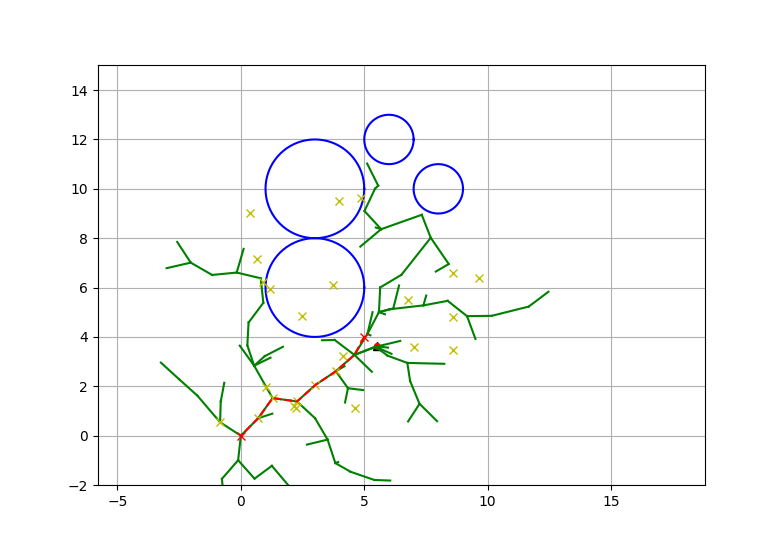
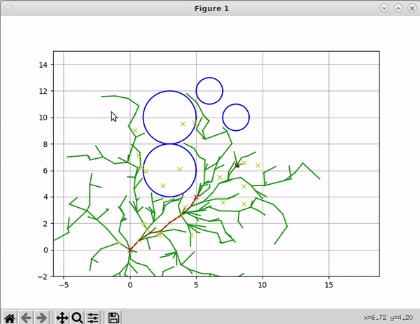
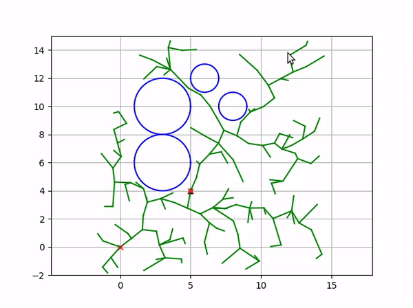

# ACO-RRT* for Path Planning

This repository implements an approach to path finding by combining Ant Colony Optimization (ACO) with the RRT* (Rapidly-exploring Random Tree Star) algorithm. This hybrid method leverages the strength of ACO by using it to guide the exploration of the RRT* algorithm.



## Setup

To install the required dependencies, navigate to the project folder and use the following commands

```bash
pip3 install -r requirements.txt
```

## Usage

* **ACO-RRT\*** 
    
    To run ACO-RRT*, navigate to the project folder and use the following commands
  
    ```bash
    cd <path_to_project>/src/
    python3 ACO_RRT*.py
    ```

* **RRT\***

    To run RRT*, navigate to the project folder and use the following commands
  
    ```bash
    cd <path_to_project>/src/
    python3 RRT*.py
    ```

## Results

A sample output of the ACO-RRT* algorithm is shown below. The algorithm finds an optimal path from the start to the goal position in a complex environment. The path is shown in green, while the obstacles are shown in red.

### ACO-RRT* Output



### RRT* Output



## Help

For more help, raise an issue and I will get back to you.
    
